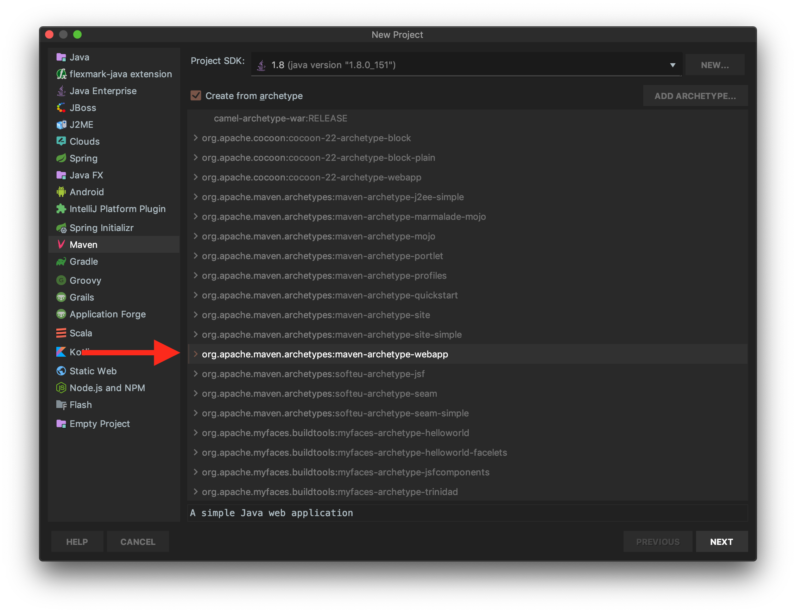
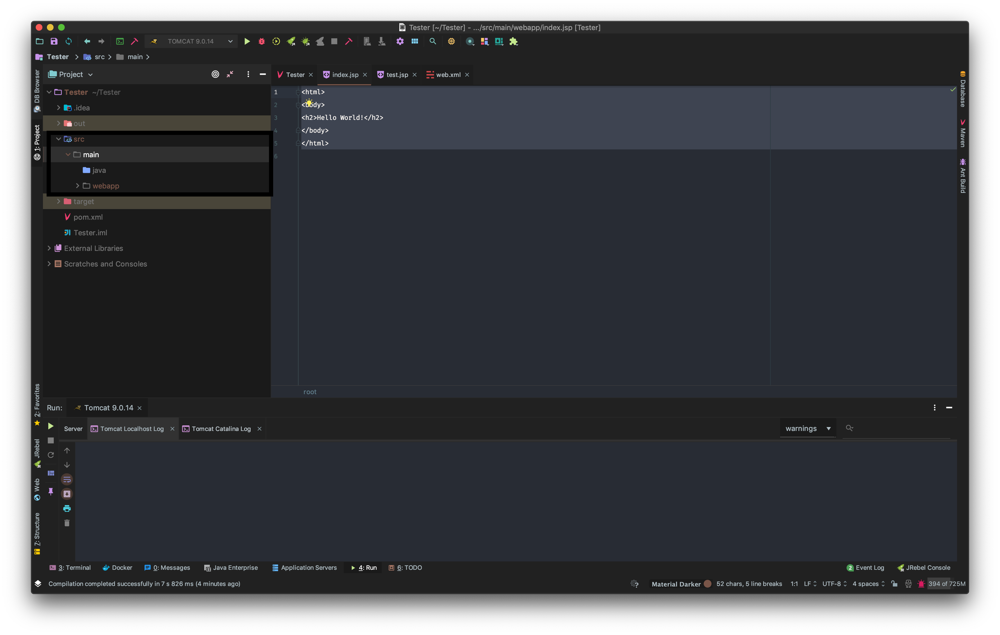
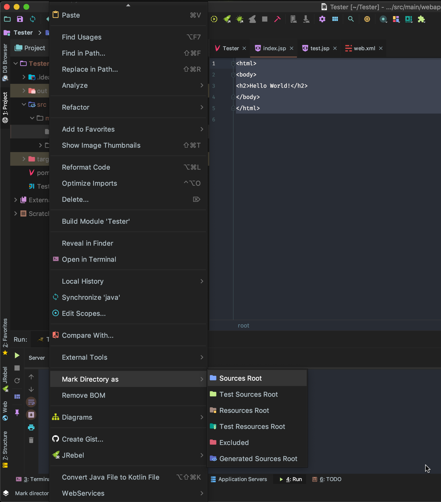
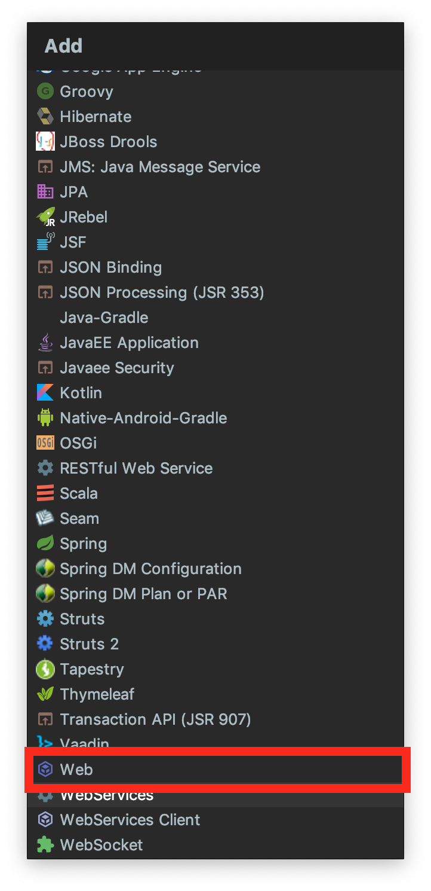
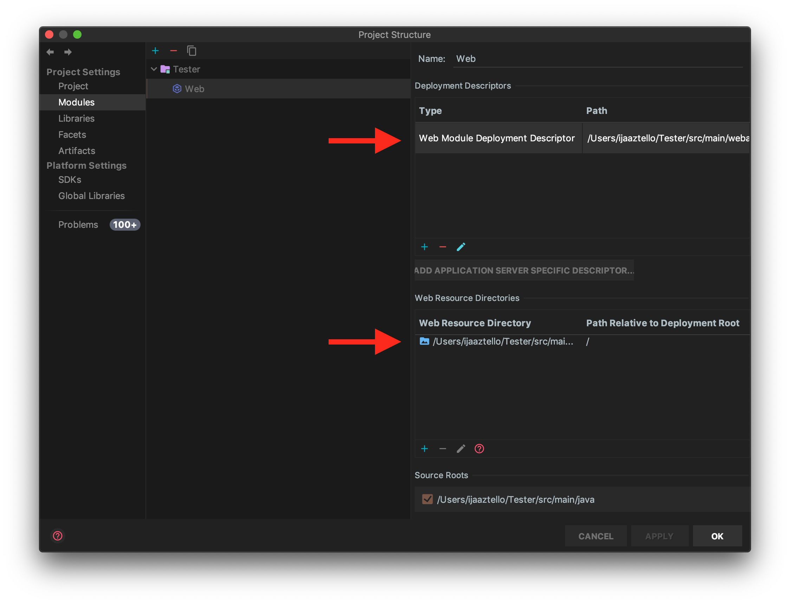

# A guide To Creating an IDE Independent Java Web Maven Project

When you create a new Maven Project from with IntelliJ, the easiest approach is to create a maven project from an archetype. The archetype creates the correct maven pom.xml and directory structure. 

The directory structure is composed of a primary *src* folder that holds a folder called main. This is where you'll put all of your code. Your main folder should consist of a premade *webapp* folder and a *java* folder (that you might have to make). The *webapp* folder holds your WEB-INF and your HTML and JSP files and the *java* folder holds all of your java code. You might need to create the java folder.

IntelliJ, by default, doesn't know that your java folder consists of your source code. To inform IntelliJ of this, you will need to mark the directory as *Source Root*.

Lastly, you will need to enter your Project Structure setting and naviage to the Modules subsection. Within the the Modules you will need to add a web module. You might need to edit the web module to point towards your *webapp* directory, as IntelliJ's web setup is different.

Lastly, if you want to edit a current project to define it as a web maven project you will need to both modify it's directory as needed and add this line to the project's pom.xml: `<packaging>war</packaging>`

I hope this helps.

If anyone has a better setup, please feel free to edit this guide.
